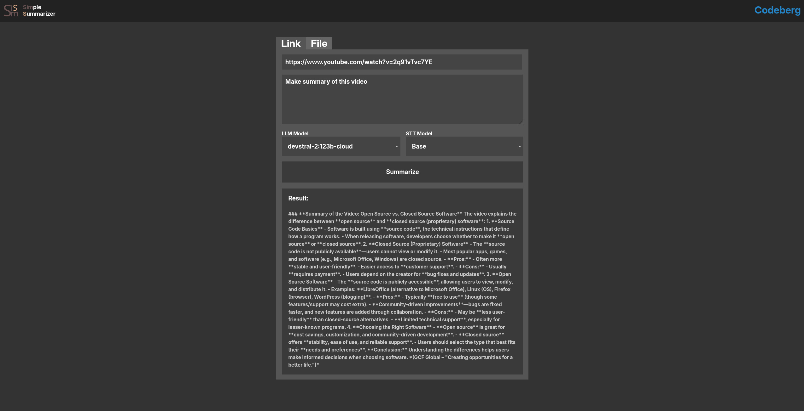

# SimS

#### SimS (Simpe Summarizer) is an application for local (without using online neural networks) video summarization

## This is a test version of the app (with bugs!), and I'm not sure if it will be developed further! It's just a personal project I created out of boredom



## Installation (on linux, a guide for Windows (maybe) will be available later)

1. Install Docker and Ollama

2. Start the docker and ollama daemons.
(If you use systemd, command is: `sudo systemctl enable ollama docker; sudo systemctl start ollama docker`)

3. Edit ollama configuration.
Enter the command `sudo systemctl edit ollama` and add this strings after first two lines:
```
[Service]
Environment="OLLAMA_HOST=0.0.0.0"
Environment="OLLAMA_KEEP_ALIVE=0"
```

4. Save and exit, then start the ollama daemon (command is `sudo systemctl restart ollama`)

5. Clone the repository:
`git clone https://codeberg.org/fractallit/SimS.git; cd SimS`

6. Rename docker-compose-example.yml to docker-compose.yml
`mv docker-compose-example.yml docker-compose.yml`

7. Enter the command `sudo docker-compose up` and wait until the app is running

8. After, you can open the app in your browser at `http://localhost:8123`

If you want to change the port, edit the file `docker-compose.yml` and change `  - "8123:5000"` to `  - "your_port:5000"`


## Usage

1. Install any of the Ollama models (example: `ollama push llama3.1:8b`)

2. Open the app in your browser at `http://localhost:8123` (or your custom port)

3. Paste the link to the video you want to summarize, or upload viedo or audio

4. Write the prompt or use default (i doubt its effectiveness)

5. Select any of the Ollama models you have installed

6. Select a model for converting audio to text

7. Click the button "Summarize"

> When you use the STT model for the first time, it will need to download, which will take some time.

